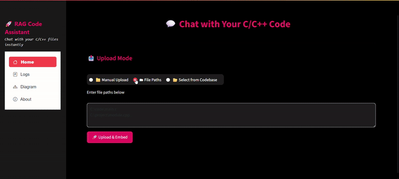

# 🧠 RAG Chat with C/C++ Code

A powerful Retrieval-Augmented Generation (RAG) assistant designed to answer natural language questions about large C/C++ codebases. It combines **CodeBERT-based embeddings**, **ChromaDB vector storage**, and **LLMs (Gemini 1.5 Flash & Cohere Command R+)** to deliver accurate and contextual responses — all wrapped in a friendly **Streamlit UI**.

---

## 🚀 Features

- 🔍 **Natural Language Code Querying**: Ask questions about C/C++ codebases (e.g., LPrint) in plain English.
- 🧠 **Powerful LLMs**: Supports both **Gemini 1.5 Flash** and **Cohere Command R+** for response generation.
- 🧩 **Precise Code Chunking**: Uses **Tree-sitter** and **Clang** for syntax-aware code parsing and chunking.
- 🧬 **CodeBERT Embeddings**: Leverages pretrained **CodeBERT** with **mean pooling** for semantic vectorization of code.
- 🧠 **ChromaDB Vector Store**: Fast and scalable retrieval using **ChromaDB**.
- 📊 **Metric-Based Evaluation**: Compares LLM outputs using:
  - **BERTScore**
  - **BLEU**
  - **ROUGE**
- 🧪 **Side-by-Side Model Comparison**: Run test queries and compare Cohere vs Gemini answers with metrics + user feedback.
- 💬 **Feedback Logging**: Stores user feedback and queries to a JSON file for analysis and retraining.

---

## 🧰 Tech Stack

| Component          | Tool/Library                            |
|--------------------|------------------------------------------|
| UI                 | Streamlit                                |
| Backend API        | FastAPI                                  |
| Code Parsing       | Tree-sitter, Clang AST                   |
| Embedding Model    | CodeBERT + Mean Pooling                  |
| Vector DB          | ChromaDB                                 |
| LLMs               | Gemini 1.5 Flash, Cohere Command R+      |
| Evaluation         | BERTScore, BLEU, ROUGE (via 🤗 evaluate) |
| Logging            | JSON-based feedback logger               |

---

---

## 📊 Evaluation Metrics

| Metric     | Description                                           |
|------------|-------------------------------------------------------|
| **BERTScore** | Measures semantic similarity using contextual embeddings |
| **BLEU**       | Measures n-gram overlap between generated and reference |
| **ROUGE**      | Measures recall-oriented overlapping units         |

Implemented using the 🤗 `evaluate` library.

---

## 🧪 Model Comparison Mode

The tool allows you to:
- Input a natural language query
- View **side-by-side responses** from Gemini and Cohere
- See scores from BERTScore, BLEU, and ROUGE
- Submit feedback on which model you preferred
All interactions and feedback are stored in:C:feedback_log.json

## To run:
Backend: python -m backend.api or uvicorn backend.api:app --reload --host 127.0.0.1 --port 9000   
Frontend: streamlit run frontend/app.py

